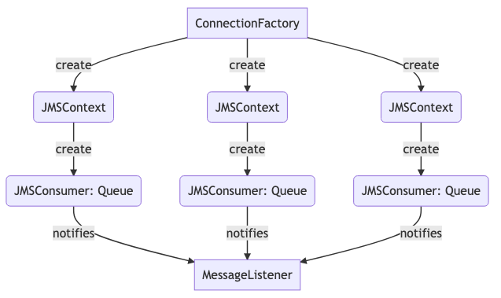
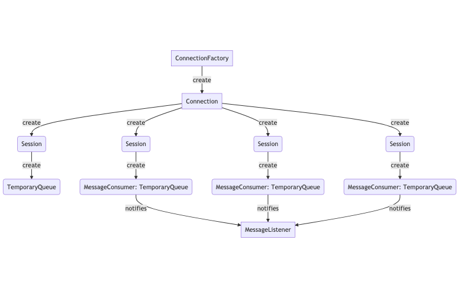
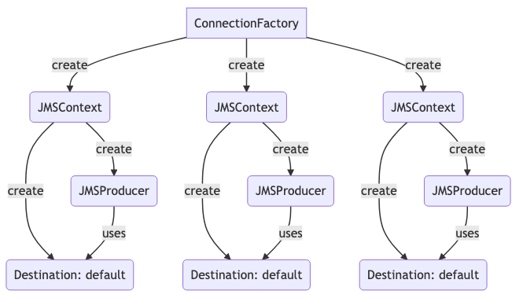

# Commons JMS

JMS Configuration Abstraction with Multi-Connection for queue listeners and producers, built on top of spring boot JMS.
This library offers a performant setup for JMS Clients.

# What's in scope

There are some scenarios covered by the library:
- Listen messages from a fixed queue.
- Send messages to a fixed queue.
- Listen messages from a temporary queue.
- Send messages to a temporary queue.

### Limitations
- Initially available for IBM MQ Clients.
- This abstraction is only available for [Project Reactor](https://projectreactor.io/) based projects, we will make it
  available for non reactor projects.

# How to use

The library can be imported like this:

```gradle
compile 'com.github.bancolombia:commons-jms-mq:<latest-version-here>'
```

## Listening for queues
To listen queues you only should add the next code fragment using the `@MQListener` annotation.

#### Listening a fixed queue

```java
@MQListener("DEV.QUEUE.1")
public Mono<Void> process(Message message) throws JMSException {  
    String text = ((TextMessage) message).getText();  
    return doSomething(text);  
}
```

This sample will listen for a fixed queue named `DEV.QUEUE.1`, the JMS objects structure will be like this:



The amount of JMSContexts and JMSConsumers is related to the `concurrency` annotation attribute, it is based on JMS 2.0.

#### Listening an autogenerated temporary queue

To listen a temporary queue you should use the `tempQueueAlias` annotation attribute, the assigned value is the key that
you would be use to get the TemporaryQueue object when needed.

```java
 // For an autogenerated temporary queue  
 @MQListener(tempQueueAlias = "any-custom-key")  
 public Mono<Void> processFromTemporaryQueue(Message message) throws JMSException {  
     String text = ((TextMessage) message).getText();  
     return doSomething(text);  
}
```

This sample will listen for an autogenerated temporary queue with key `any-custom-key`, the JMS objects structure will
be like this:



The amount of Sessions and MessageConsumers is related to the `concurrency` annotation attribute, it is based on JMS 1.1.

## Sending messages

To send messages exists the `@EnableMQMessageSender` annotation which enables the producers auto-configuration.

This configuration creates a JMS objects structure like this:



The amount of JMSContexts and JMSProducers is related to the `concurrency` property [see setup](#Setup), it is based on
JMS 2.0.

#### Send message to a fixed queue

```java
@Component  
@AllArgsConstructor  
@EnableMQMessageSender  
public class SampleMQMessageSender {  
  private final MQMessageSender sender;  
//private final MQTemporaryQueuesContainer container; // Inject it to reference a temporary queue  
  
  public Mono<String> send(String message) {  
    return sender.send(context -> {  
      Message textMessage = context.createTextMessage(message);  
//    textMessage.setJMSReplyTo(container.get("any-custom-key")); // Inject the reply to queue from container
      return textMessage; 
    });  
  }  
}
```

This sample shows how to send a message to a default destination queue, also shows how reference an autogenerated
temporary queue.

#### Send message to another queue

```java
public Mono<String> sendWithDestination(String message) {  
  return sender.send(destination, context -> context.createTextMessage(message));  
}
```

This sample shows how you can pass any `Destination` as first parameter of send, with it you can send a message to any
dynamic destination.

## Setup

### Listener properties

There are two complementary configuration ways. First when creates a method annotated with `@MQListener`, you can set
the next properties:

- **value**: *Name of the listening queue*, use only when listen for a fixed queue
- **concurrency**:  *Number of open connections to listening the queue*, applies for fixed and temporary queues.
- **connectionFactory**: *Name of a specific `ConnectionFactory` Bean*, used to create the connections for this consumer.
- **tempQueueAlias**: *An arbitrary key or identifier for an autogenerated temporary queue*, por ejemplo `my-id`, use
  only when listen for a temporary queue
- **queueCustomizer**: *Name of a specific `MQQueueCustomizer` Bean*, used to customize the listening queue properties
  before start the consumers.

The next properties can be used when you have a single `@MQListener` annotated method, and it can be set in the
application.yaml of your application.

- `commons.jms.input-concurrency`: Equivalent to `concurrency` annotation property.
- `commons.jms.input-queue`: Equivalent to `value` annotation property.
- `commons.jms.input-queue-alias`: Equivalent to `tempQueueAlias` annotation property.

### Sender properties

There are three configuration properties:
- `commons.jms.output-concurrency`: *Number of open connections to send messages to a queue*.
- `commons.jms.output-queue`: *Name of the default queue to send messages*.
- `commons.jms.producer-ttl`: *Long value in milliseconds which sets the time to live of a message put onto a queue. A
  value of 0 means live indefinitely*.

### Connection Factory

This library uses the default bean of kind `ConnectionFactory`, you can customize listeners setting the
`connectionFactory` attribute of the `@MQListener` annotated method.

To customize sender you should override the default `MQMessageSenderSync` bean refers to
[Custom configurations](#Custom-configurations)


### Custom configurations

You can define custom beans to change default behaviors:
-  [`MQAutoconfiguration`](commons-jms-mq/src/main/java/co/com/bancolombia/commons/jms/mq/config/MQAutoconfiguration.java)
-  [`MQAutoconfigurationSender`](commons-jms-mq/src/main/java/co/com/bancolombia/commons/jms/mq/config/MQAutoconfigurationSender.java)


# License

This repository is licensed under [MIT License](./LICENSE) Copyright (c) 2021 Bancolombia S.A
