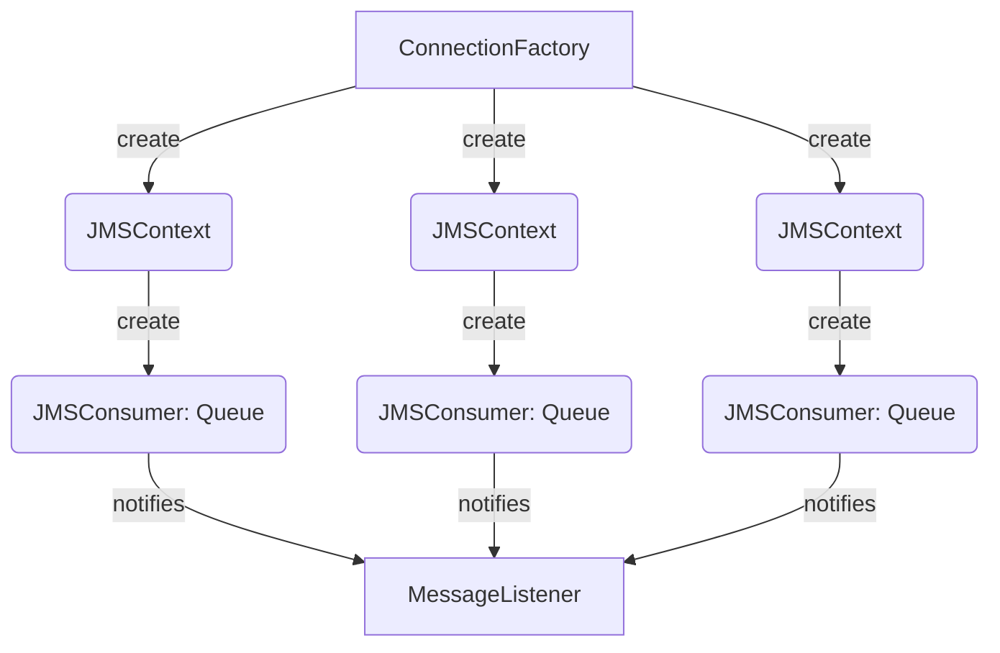
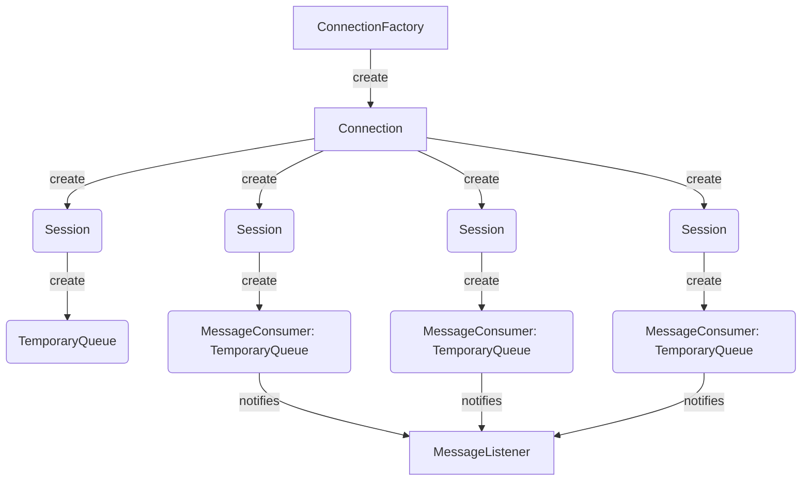
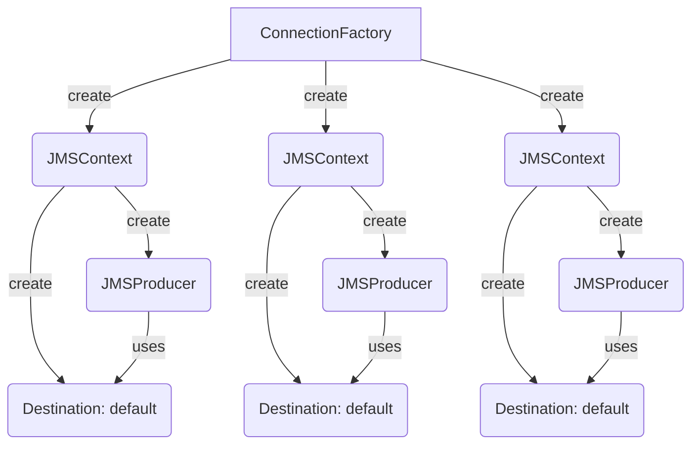

# Commons JMS

[](https://sonarcloud.io/dashboard?id=bancolombia_commons-jms)
[](https://sonarcloud.io/dashboard?id=bancolombia_commons-jms)
[](https://sonarcloud.io/dashboard?id=bancolombia_commons-jms)
[](https://sonarcloud.io/dashboard?id=bancolombia_commons-jms)
[](https://sonarcloud.io/dashboard?id=bancolombia_commons-jms)
[](https://sonarcloud.io/dashboard?id=bancolombia_commons-jms)
[](https://sonarcloud.io/dashboard?id=bancolombia_commons-jms)
[](https://github.com/bancolombia/commons-jms/actions/workflows/scorecards-analysis.yml)

JMS Configuration Abstraction with Multi-Connection for queue listeners and producers, built on top of spring boot JMS.
This library offers a performant setup for JMS Clients.

# What's in scope

There are some scenarios covered by the library:

- Listen messages from a fixed queue.
- Send messages to a fixed queue.
- Listen messages from a temporary queue.
- Send messages to a temporary queue.
- Get messages with specific correlationId from a fixed queue.
- Request Reply pattern with automatic temporary queue.

## Compatibility

| Version | Spring Boot | Specification |
|---------|-------------|---------------|
| 0.6.0   | 2.7.6       | JMS 2 javax   |
| 1.0.1   | 3.0.6       | JMS 3 jakarta |


### Limitations

- Initially available for IBM MQ Clients.

# How to use

The library can be imported like this:

```gradle
compile 'com.github.bancolombia:commons-jms-mq:<latest-version-here>'
```

## Listening for queues

To listen queues you only should add the next code fragment using the `@MQListener` annotation.

#### Listening a fixed queue reactive

```java
@MQListener("DEV.QUEUE.1")
public Mono<Void> process(Message message) throws JMSException {
  String text=((TextMessage)message).getText();
  return doSomething(text);
}
```

#### Listening a fixed queue non reactive

```java
@MQListener("DEV.QUEUE.1")
public void process(Message message) throws JMSException {
  String text=((TextMessage)message).getText();
  doSomething(text);
}
```

This sample will listen for a fixed queue named `DEV.QUEUE.1`, the JMS objects structure will be like this:



The amount of JMSContexts and JMSConsumers is related to the `concurrency` annotation attribute, it is based on JMS 2.0.

#### Listening an autogenerated temporary queue

To listen a temporary queue you should use the `tempQueueAlias` annotation attribute, the assigned value is the key that
you would be use to get the TemporaryQueue object when needed.

```java
 // For an autogenerated temporary queue  
@MQListener(tempQueueAlias = "any-custom-key")
public Mono<Void> processFromTemporaryQueue(Message message)throws JMSException{
  String text=((TextMessage)message).getText();
  return doSomething(text);
}
```

```java
 // For an autogenerated temporary queue non reactive project
@MQListener(tempQueueAlias = "any-custom-key")
public void processFromTemporaryQueue(Message message)throws JMSException{
  String text=((TextMessage)message).getText();
  doSomething(text);
}
```

This sample will listen for an autogenerated temporary queue with key `any-custom-key`, the JMS objects structure will
be like this:



The amount of Sessions and MessageConsumers is related to the `concurrency` annotation attribute, it is based on JMS
1.1.

#### Listening for a specific message

To listen for specific messages is enough with enable message listener selector with the next class annotation:

```java
@Configuration
@EnableMQSelectorMessageListener
public class AnyConfigurationComponentOrService {
}
```

This annotation will create an available bean that offers the ability to get an specific message from a queue using the correlationId attribute, there are two bean options:

For reactive projects will be `MQMessageSelectorListener` bean which has the next two methods:

```java
public interface MQMessageSelectorListener {  
  Mono<Message> getMessage(String correlationId);  
  Mono<Message> getMessage(String correlationId, long timeout, Destination destination);  
}
```

For non-reactive projects will be `MQMessageSelectorListenerSync` bean which has the next two methods:

```java
public interface MQMessageSelectorListenerSync {  
  Message getMessage(String correlationId);
  Message getMessage(String correlationId, long timeout, Destination destination);  
}
```

The above beans can throw a `JMSRuntimeException` or a `ReceiveTimeoutException`.

## Sending messages

To send messages exists the `@EnableMQMessageSender` annotation which enables the producers auto-configuration.

This configuration creates a JMS objects structure like this:



The amount of JMSContexts and JMSProducers is related to the `concurrency` property [see setup](#Setup), it is based on
JMS 2.0.

#### Send message to a fixed queue reactive

```java

@Component
@AllArgsConstructor
@EnableMQMessageSender
public class SampleMQMessageSender {
    private final MQMessageSender sender;
//  private final MQQueuesContainer container; // Inject it to reference a temporary queue  

    public Mono<String> send(String message) {
        return sender.send(context -> {
            Message textMessage = context.createTextMessage(message);
//          textMessage.setJMSReplyTo(container.get("any-custom-key")); // Inject the reply to queue from container
            return textMessage;
        });
    }
}
```

#### Send message to a fixed queue non reactive project

```java

@Component
@AllArgsConstructor
@EnableMQMessageSender
public class SampleMQMessageSender {
    private final MQMessageSenderSync sender;
//  private final MQQueuesContainer container; // Inject it to reference a temporary queue  

    public String send(String message) {
        return sender.send(context -> {
            Message textMessage = context.createTextMessage(message);
//          textMessage.setJMSReplyTo(container.get("any-custom-key")); // Inject the reply to queue from container
            return textMessage;
        });
    }
}
```

This sample shows how to send a message to a default destination queue, also shows how reference an autogenerated
temporary queue.

#### Send message to another queue

```java
public Mono<String> sendWithDestination(String message){
  return sender.send(destination,context->context.createTextMessage(message));
}
```

```java
// non reactive projects
public String sendWithDestination(String message){
  return sender.send(destination,context->context.createTextMessage(message));
}
```

This sample shows how you can pass any `Destination` as first parameter of send, with it you can send a message to any
dynamic destination.

### Request Reply Temporary Queue

This is a basic implementation of the Request Reply pattern, basically it creates a temporary queue for responses and
starts listening it, it creates its listener and autogenerate an instance that can be pseudo defined by the user as an
interface, which implements the interface.

The application that attends the request should follow the replyTo header which is automatically injected through the
operation:
```java
textMessage.setJMSReplyTo(temporaryQueue)
```

This approach is only implemented for reactive projects, so you can define your own interface with at least one of the
next interface signatures:

```java
    Mono<Message> requestReply(String message);

    Mono<Message> requestReply(String message, Duration timeout);

    Mono<Message> requestReply(MQMessageCreator messageCreator);

    Mono<Message> requestReply(MQMessageCreator messageCreator, Duration timeout);
```

For example, you define an interface like the next, so it could be auto implemented by the library:
this [MyRequestReply](examples/mq-reactive/src/main/java/co/com/bancolombia/jms/sample/drivenadapters/reqreply/MyRequestReply.java)
```java
public interface MyRequestReply {
    Mono<Message> requestReply(String message);
}
```

To achieve the auto implementation, you should:

  1. Annotate the application or a configuration bean with @EnableReqReply, optionally you can define the base package
  ```java
     @SpringBootApplication(scanBasePackages = "co.com.bancolombia")
     @EnableReqReply(scanBasePackages = "co.com.bancolombia")
     public class MainApplication {
        public static void main(String[] args) {
            SpringApplication.run(MainApplication.class);
        }
     }
   ```

  2. Annotate the interface with @ReqReply, for example
  ```java
      @ReqReply(requestQueue = "DEV.QUEUE.1", replyQueueTemp = "sample")
      public interface MyRequestReply {
        Mono<Message> requestReply(String message);
      }
   ```

  3. Now you can inject your interface in any spring component.
     [MyRequestReplyAdapter](examples/mq-reactive/src/main/java/co/com/bancolombia/jms/sample/drivenadapters/reqreply/MyRequestReplyAdapter.java)
  ```java
    @Component
    @AllArgsConstructor
    public class MyRequestReplyAdapter implements RequestGateway {
        private final MyRequestReply requestReply;
        ...
    }
  ```

Is possible that you require to add the line before the `SpringApplication.run(MainApplication.class, args);` like:
```java
 public static void main(String[] args) {
    System.setProperty("spring.devtools.restart.enabled", "false");
    SpringApplication.run(MainApplication.class, args);
}
```

### Request Reply Fixed Queue
When the use of a temporary queue is not available for persistent reasons, or lost of messages is not allowed
you can use a Request Reply pattern based on a fixed queue, you should consider the next scenarios:

- Single Queue Manager:
    In this scenario you should not consider any setup. Following code snippet can show a basic implementation:

    ```java
    public Mono<String> requestReply(String request) {
        return sender.send(context -> context.createTextMessage(request))
                .flatMap(listener::getMessage)
                .map(this::extractResult);
    }

    @SneakyThrows
    private String extractResult(Message message) {
        return ((TextMessage) message).getText();
    }
   ```

- Multiple Queue Manager or Clustering:
    In this scenario you should guarantee that:
  - the application that attends the request follow the replyTo header.
  - set to `true` the property `commons.jms.input-queue-set-queue-manager` to identify and set the queue manager to the
    response queue (this guarantees that the application that attends the request send the response to the specific
    queue manager).
    
  Following code snippet can show a basic implementation:

    ```java
    public Mono<String> requestReply(String request) {
        return sender.send(context -> {
                   Message message =  context.createTextMessage(request);
                   message.setJMSReplyTo(container.get("RESPONSE.QUEUE.NAME"));
                   return message;
                })
                .flatMap(listener::getMessage)
                .map(this::extractResult);
    }

    @SneakyThrows
    private String extractResult(Message message) {
        return ((TextMessage) message).getText();
    }
   ```

In both scenarios you should use the `MQMessageSender`, the `MQMessageSelectorListener` and maybe the `MQQueuesContainer`.

## Setup

### General properties

- `commons.jms.reactive`: Should be set to `true` for reactive (Reactor) projects.

### Listener properties

There are two complementary configuration ways. First when creates a method annotated with `@MQListener`, you can set
the next properties:

- **value**: *Name of the listening queue*, use only when listen for a fixed queue
- **concurrency**:  *Number of open connections to listening the queue*, applies for fixed and temporary queues.
- **connectionFactory**: *Name of a specific `ConnectionFactory` Bean*, used to create the connections for this
  consumer.
- **tempQueueAlias**: *An arbitrary key or identifier for an autogenerated temporary queue*, por ejemplo `my-id`, use
  only when listen for a temporary queue
- **queueCustomizer**: *Name of a specific `MQQueueCustomizer` Bean*, used to customize the listening queue properties
  before start the consumers.

The next properties can be used when you have a single `@MQListener` annotated method, and it can be set in the
application.yaml of your application.

- `commons.jms.input-concurrency`: Equivalent to `concurrency` annotation property.
- `commons.jms.input-queue`: Equivalent to `value` annotation property.
- `commons.jms.input-queue-alias`: Equivalent to `tempQueueAlias` annotation property.
- `commons.jms.input-queue-set-queue-manager`: Enable it to set the resolved queue manager when needed.

### Sender properties

There are three configuration properties:

- `commons.jms.output-concurrency`: *Number of open connections to send messages to a queue*.
- `commons.jms.output-queue`: *Name of the default queue to send messages*.
- `commons.jms.producer-ttl`: *Long value in milliseconds which sets the time to live of a message put onto a queue. A
  value of 0 means live indefinitely*.

### Connection Retry properties
- `commons.jms.max-retries`: Number of retries when the connection is lost.
- `commons.jms.initial-retry-interval-millis`: Initial interval between retries in milliseconds.
- `commons.jms.retry-multiplier`: Multiplier for the interval between retries.

For more information about the connection retry properties, please refer to [Resilience4j Retry](https://resilience4j.readme.io/docs/retry)

### Connection Factory

This library uses the default bean of kind `ConnectionFactory`, you can customize listeners setting the
`connectionFactory` attribute of the `@MQListener` annotated method.

To customize sender you should override the default `MQMessageSenderSync` bean refers to
[Custom configurations](#Custom-configurations)

### Custom configurations

You can define custom beans to change default behaviors:

- [`MQAutoconfiguration`](commons-jms-mq/src/main/java/co/com/bancolombia/commons/jms/mq/config/MQAutoconfiguration.java)
- [`MQAutoconfigurationSender`](commons-jms-mq/src/main/java/co/com/bancolombia/commons/jms/mq/config/MQAutoconfigurationSender.java)
- [`MQQueueManagerSetter`](commons-jms-mq/src/main/java/co/com/bancolombia/commons/jms/mq/config/MQAutoconfigurationSelectorListener.java)

You should create and register many fixed response queues for request reply, in this case you can override the
`MQQueueManagerSetter` as following:

```java
    @Bean
    @ConditionalOnMissingBean(MQQueueManagerSetter.class)
    public MQQueueManagerSetter qmSetter(MQProperties properties, MQQueuesContainer container,
                                         @Value("${response.queue.a}") String queueAName,
                                         @Value("${response.queue.b}") String queueBName) {
        return (jmsContext, queue) -> {
            log.info("Self assigning Queue Manager to listening queue: {}", queue.toString());
            MQUtils.setQMNameIfNotSet(jmsContext, queue);
            container.registerQueue(properties.getInputQueue(), queue);
            // Register response queue a with queue manager assigned
            Queue queueA = jmsContext.createQueue(queueAName);
            MQUtils.setQMNameIfNotSet(jmsContext, queueA);
            container.registerQueue(queueAName, queueA);
            // Register response queue b with queue manager assigned
            Queue queueB = jmsContext.createQueue(queueBName);
            MQUtils.setQMNameIfNotSet(jmsContext, queueB);
            container.registerQueue(queueBName, queueB);
        };
    }
```

### Usual utilities

- [`MQUtils`](commons-jms-mq/src/main/java/co/com/bancolombia/commons/jms/mq/utils/MQUtils.java)

# How can I help?

Review the issues, we hear new ideas. Read more [Contributing](./CONTRIBUTING.md)

# License

This repository is licensed under [MIT License](./LICENSE) Copyright (c) 2021 Bancolombia S.A
