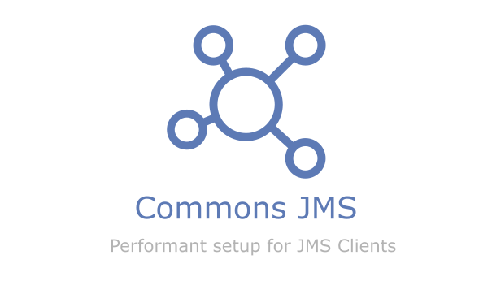

# Overview

## Commons JMS

JMS Configuration Abstraction with Multi-Connection for queue listeners and producers, built on top of spring boot JMS. This library offers a performant setup for JMS Clients.

## Scope

There are some scenarios covered by the library:

Listen messages from a fixed queue.
Send messages to a fixed and temporary queues.
Request Reply pattern with automatic temporary queue.
Request Reply pattern with automatic get message by selector from fixed queue.

## Versioning

Commons JMS uses [Semantic Versioning Specification](https://semver.org)

Commons JMS uses a MAJOR.MINOR.PATCH scheme, whereby an increment in:

MAJOR version when you make incompatible API changes,

MINOR version when you add functionality in a backwards compatible manner, and

PATCH version when you make backwards compatible bug fixes. Additional labels for pre-release and build metadata are available as extensions to the MAJOR.MINOR.PATCH format. == New & Noteworthy

## Compatibility

|  Version | Spring Boot | Specification |
|----------|-------------|---------------|
|   0.6.0  |    2.7.6    | JMS 2 javax   |
| >= 1.0.1 | >= 3.0.6    | JMS 3 jakarta |
