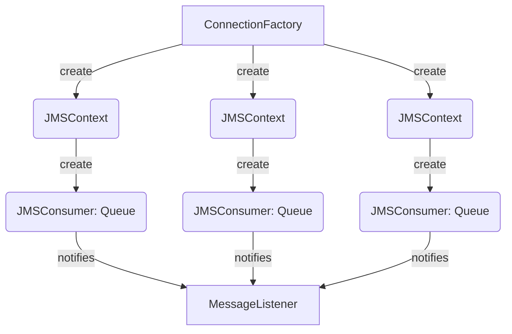

# Listening for queues

To listen queues you only should add the next code fragment using the `@MQListener` annotation.

In the `@MQListener` annotation you can set the next properties:

- **value**: *Name of the listening queue*, use only when listen for a fixed queue
- **concurrency**:  *Number of open connections to listening the queue*, applies for fixed and temporary queues.
- **connectionFactory**: *Name of a specific `ConnectionFactory` Bean*, used to create the connections for this
  consumer.
- **queueCustomizer**: *Name of a specific `MQQueueCustomizer` Bean*, used to customize the listening queue properties
  before start the consumers.

## Listening a fixed queue reactive

```java
@MQListener("DEV.QUEUE.1")
public Mono<Void> process(Message message) throws JMSException {
  String text=((TextMessage)message).getText();
  return doSomething(text);
}
```

You also can set name from properties to make it dynamic configurable

```java
@MQListener("${commons.jms.input-queue}")
public Mono<Void> process(Message message) throws JMSException {
  String text=((TextMessage)message).getText();
  return doSomething(text);
}
```

You also can pass specific listener settings like:

```java
@MQListener(value = "${commons.jms.input-queue}", concurrency = "5", maxRetries = "5", connectionFactory = "domainB")
public Mono<Void> process(Message message) throws JMSException {
  String text=((TextMessage)message).getText();
  return doSomething(text);
}
```

## Listening a fixed queue non reactive

In this case the main difference is the return type of the annotated method, in reactive should be `Mono<Void>` and the method should return the reactive flow resolving a `Mono<Void>`. In non reactive must be `void` and in this case no return value is required

```java
@MQListener("DEV.QUEUE.1")
public void process(Message message) throws JMSException {
  String text=((TextMessage)message).getText();
  doSomething(text);
}
```

## Connection Architecture

This sample will listen for a fixed queue named `DEV.QUEUE.1`, the JMS objects structure will be like this:




The amount of JMSContexts and JMSConsumers is related to the `concurrency` annotation attribute, it is based on JMS 2.0.

The amount of Sessions and MessageConsumers is related to the `concurrency` annotation attribute, it is based on JMS
1.1.