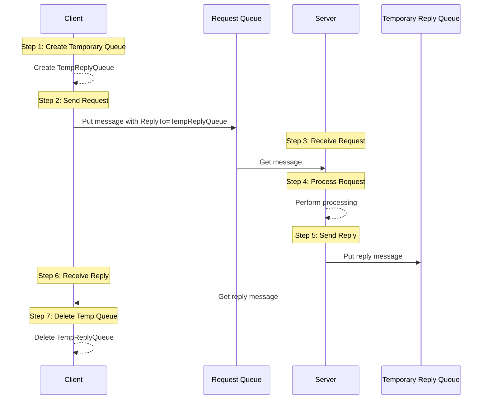
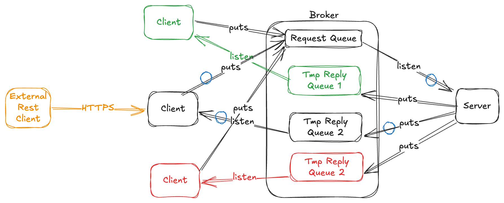

# Temporary Queue

This is a basic implementation of the Request Reply pattern, basically it creates a temporary queue for responses and
starts listening it.





For example, you define an interface like the next, so it could be auto implemented by the library:
this [MyRequestReplyTmp](https://github.com/bancolombia/commons-jms/blob/main/examples/mq-reactive/src/main/java/co/com/bancolombia/sample/drivenadapters/reqreply/MyRequestReplyTmp.java)

To achieve the auto implementation, you should:

1. Annotate the application or a configuration bean with @EnableMQGateway, optionally you can define the base package

  ```java
     @SpringBootApplication(scanBasePackages = "co.com.bancolombia")
     @EnableMQGateway(scanBasePackages = "co.com.bancolombia")
     public class MainApplication {
        public static void main(String[] args) {
            SpringApplication.run(MainApplication.class);
        }
     }
   ```

2. Annotate the interface with @ReqReply, for example

  ```java
    @ReqReply(requestQueue = "DEV.QUEUE.1") // in queue names you can use ${some.property.name} spring placeholder notation
    public interface MyRequestReplyTmp extends MQRequestReply {
    }
   ```

3. Now you can inject your interface in any spring component.
   [MyRequestReplyAdapter](https://github.com/bancolombia/commons-jms/blob/main/examples/mq-reactive/src/main/java/co/com/bancolombia/sample/drivenadapters/reqreply/MyRequestReplyAdapter.java)

  ```java
    @Component
    @AllArgsConstructor
    public class MyRequestReplyAdapter implements RequestGateway {
        private final MyRequestReplyTmp requestReply;
        ...
    }
  ```

  And you can use the next methods to send and receive messages

  ```java
    Mono<T> requestReply(String message);

    Mono<T> requestReply(String message, Duration timeout);

    Mono<T> requestReply(MQMessageCreator messageCreator);

    Mono<T> requestReply(MQMessageCreator messageCreator, Duration timeout);
  ```

Is possible that you require to add the line before the `SpringApplication.run(MainApplication.class, args);` like:

```java
 public static void main(String[] args) {
    System.setProperty("spring.devtools.restart.enabled", "false");
    SpringApplication.run(MainApplication.class, args);
}
```

Below graph can describe the communication components.

In this case the `Client` creates a temporary queue for each instance, so it guarantees that the response will be received only by the instance that makes the request. To achieve this, the `Client` creates a temporary queue, sends the request message to the `Request Queue` with the `JMSReplyTo` header set to the temporary queue, then the `Server` receives the request message, processes it and sends the response message to the temporary queue. Finally, the `Client` receives the response message from the temporary queue and deletes it.



This scenario is useful when you have multiple instances of the `Client` and you need to ensure that the response is received by the same instance that made the request. However, it has some limitations, such as:
- Temporary queues are deleted when the connection that created them is closed, so if the `Client` crashes or loses the connection, the temporary queue will be lost and the response will not be received.
- Some JMS providers have limitations on the number of temporary queues that can be created, so if you have a high number of `Client` instances, you may run into these limits.
- Temporary queues are not persistent, so if the JMS provider restarts, the temporary queues will be lost and the response will not be received.

By default the response message is correlated using the `JMSCorrelationID` header, which is set from the `JMSMessageID` of the request message.

If you need to customize this behavior, you can implement a custom correlation extractor of the interface `CorrelationIdExtractor` and define a bean with it, for example based on the response `JMSMessageID`:

```java
@Bean
public CorrelationExtractor myCorrelationExtractor() {
    return Message::getJMSMessageID;
}
```
Or another complex logic:

```java
@Bean
public CorrelationExtractor myCorrelationExtractor() {
    return message -> {
        // custom logic to extract correlation ID from any part of the message
        return ...;
    };
}
```

The default implementation is:

```java
@Bean
public CorrelationExtractor defaultCorrelationExtractor() {
    return Message::getJMSCorrelationID;
}
```