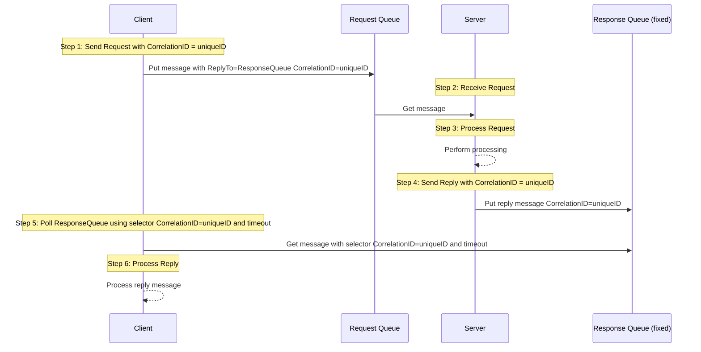
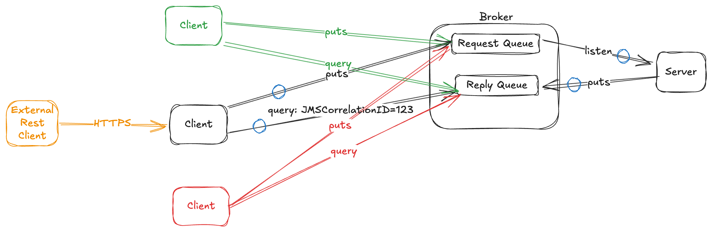

# Fixed Queue by Selector

This is a basic implementation of the Request Reply pattern, basically it uses a fixed queue for responses but not has a continuous listening mechanism, instead it uses a message selector to filter responses.





For example, you define an interface like the next, so it could be auto implemented by the library:
this [MyRequestReply](https://github.com/bancolombia/commons-jms/blob/main/examples/mq-reactive/src/main/java/co/com/bancolombia/sample/drivenadapters/reqreply/MyRequestReply.java)

To achieve the auto implementation, you should:

1. Annotate the application or a configuration bean with @EnableMQGateway, optionally you can define the base package

  ```java
     @SpringBootApplication(scanBasePackages = "co.com.bancolombia")
     @EnableMQGateway(scanBasePackages = "co.com.bancolombia")
     public class MainApplication {
        public static void main(String[] args) {
            SpringApplication.run(MainApplication.class);
        }
     }
   ```

2. Annotate the interface with @ReqReply, for example

  ```java
    @ReqReply(requestQueue = "DEV.QUEUE.1", replyQueue = "DEV.QUEUE.2", queueType = FIXED) // in queue names you can use ${some.property.name} spring placeholder notation
    public interface MyRequestReply extends MQRequestReply {
    }
   ```

3. Now you can inject your interface in any spring component.
   [MyRequestReplyAdapter](https://github.com/bancolombia/commons-jms/blob/main/examples/mq-reactive/src/main/java/co/com/bancolombia/sample/drivenadapters/reqreply/MyRequestReplyAdapter.java)

  ```java
    @Component
    @AllArgsConstructor
    public class MyRequestReplyAdapter implements RequestGateway {
        private final MyRequestReply requestReply;
        ...
    }
  ```

  And you can use the next methods to send and receive messages

  ```java
    Mono<T> requestReply(String message);

    Mono<T> requestReply(String message, Duration timeout);

    Mono<T> requestReply(MQMessageCreator messageCreator);

    Mono<T> requestReply(MQMessageCreator messageCreator, Duration timeout);

    Mono<T> requestReply(String message, Destination request, Destination reply, Duration timeout);

    Mono<T> requestReply(MQMessageCreator messageCreator, Destination request, Destination reply, Duration timeout);
  ```

Is possible that you require to add the line before the `SpringApplication.run(MainApplication.class, args);` like:

```java
 public static void main(String[] args) {
    System.setProperty("spring.devtools.restart.enabled", "false");
    SpringApplication.run(MainApplication.class, args);
}
```

Below graph can describe the communication components.



This scenario is useful when you need to have a persistent response queue, for example when the response message is critical and you cannot lose it, or when the broker does not support temporary queues.

The main disadvantage of this approach is that the client must poll the response queue using a selector and a timeout, this can generate a high load on the broker if there are many clients or many requests, also the response time can be higher than using a temporary queue.

By default the response message is correlated using the `JMSCorrelationID` header, which is set to the `JMSMessageID` of the request message.

If you need to customize the correlation, you can implement the interface `SelectorBuilder` and define a bean with it, for example:

```java
@Bean
public SelectorBuilder mySelectorBuilder() {
    return SelectorBuilder.fromJMSMessageID(); // return correlationId -> "JMSMessageID='" + correlationId + "'";
}
```

The default implementation is `SelectorBuilder.ofDefaults()`, which is equivalent to `SelectorBuilder.fromJMSCorrelationID()` and finally equals to:
```java
correlationId -> "JMSCorrelationID='" + correlationId + "'";
```