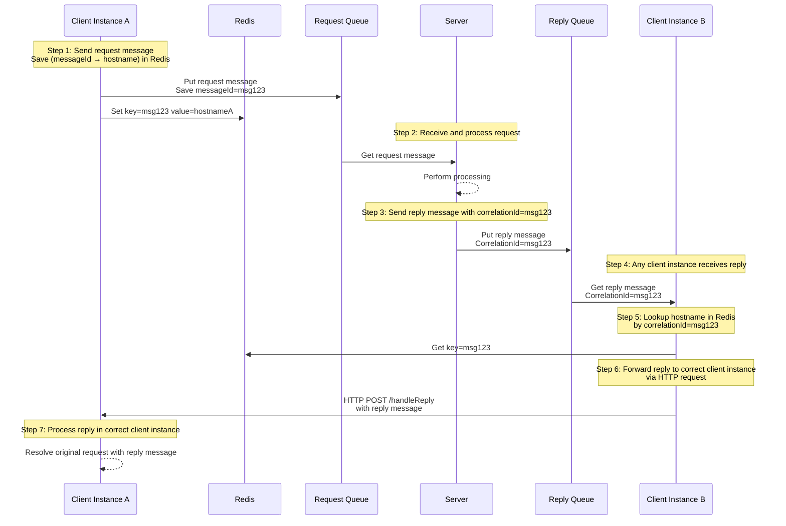

# Fixed Queue Location Transparency

This is a more complex implementation of the Request Reply pattern, basically it uses a fixed queue for responses but with a continuous listening mechanism, which allows for more dynamic response handling and increases performance.

This scenario uses an external shared storage (like Redis, Memcached, or a database) to map correlation IDs to specific client instances. This way, when a response is received, any instance can look up the correct client instance to forward the response to the appropriate instance through a HTTP request.




For example, you define an interface like the next, so it could be auto implemented by the library:
this [MyRequestReplySingleInstance](https://github.com/bancolombia/commons-jms/blob/main/examples/mq-reactive/src/main/java/co/com/bancolombia/sample/drivenadapters/reqreply/MyRequestReplySingleInstance.java)

To achieve the auto implementation, you should:

1. Annotate the application or a configuration bean with @EnableMQGateway, optionally you can define the base package

  ```java
     @SpringBootApplication(scanBasePackages = "co.com.bancolombia")
     @EnableMQGateway(scanBasePackages = "co.com.bancolombia")
     public class MainApplication {
        public static void main(String[] args) {
            SpringApplication.run(MainApplication.class);
        }
     }
   ```

2. Annotate the interface with @ReqReply, for example

  ```java
    @ReqReply(requestQueue = "DEV.QUEUE.1", replyQueue = "DEV.QUEUE.2", queueType = FIXED_LOCATION_TRANSPARENCY) // in queue names you can use ${some.property.name} spring placeholder notation
    public interface MyRequestReply extends MQRequestReply {
    }
   ```

3. Now you can inject your interface in any spring component.
   [MyRequestReplyAdapter](https://github.com/bancolombia/commons-jms/blob/main/examples/mq-reactive/src/main/java/co/com/bancolombia/sample/drivenadapters/reqreply/MyRequestReplyAdapter.java)

  ```java
    @Component
    @AllArgsConstructor
    public class MyRequestReplyAdapter implements RequestGateway {
        private final MyRequestReply requestReply;
        ...
    }
  ```

  And you can use the next methods to send and receive messages

  ```java
    Mono<T> requestReply(String message);

    Mono<T> requestReply(String message, Duration timeout);

    Mono<T> requestReply(MQMessageCreator messageCreator);

    Mono<T> requestReply(MQMessageCreator messageCreator, Duration timeout);
  ```

Is possible that you require to add the line before the `SpringApplication.run(MainApplication.class, args);` like:

```java
public static void main(String[] args) {
  System.setProperty("spring.devtools.restart.enabled", "false");
  SpringApplication.run(MainApplication.class, args);
}
```

## Additional Configuration

You should import the additional dependency:

```gradle
implementation 'com.github.bancolombia:commons-jms-http-replier:<latest-version-here>'
```

Add annotation to one of your configuration beans or main application class

```java
@EnableMQHttpReplies
@Configuration
public class SomeConfiguration {
    ...
}
```

### Location Manager

You should implement your own `LocationManager` instance:

```java
public interface LocationManager {

    Mono<Void> set(String id, Duration timeout);

    Mono<String> get(String id);
}
```

For example [RedisCache](https://github.com/bancolombia/commons-jms/blob/main/examples/adapter-redis/src/main/java/co/com/bancolombia/sample/redis/RedisCache.java)

### HTTP Server

You also need to import the default http server configuration, to achieve this you can define the next configuration properties:

```yaml
commons.jms.reply.port: 8000 # Port should be different from the exposed by the application
commons.jms.reply.timeout: 5000 # milliseconds
```
