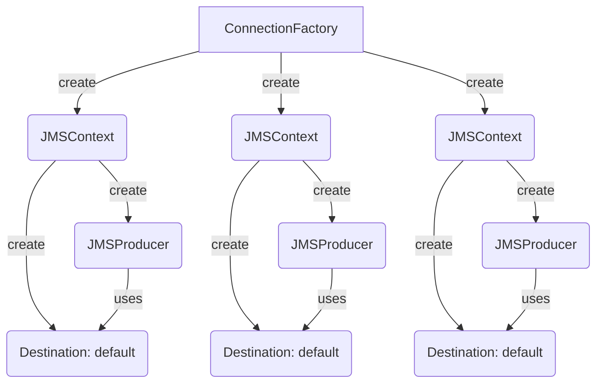

# Sending Messages

To send messages exists the `@EnableMQGateway` annotation which enables the producers auto-configuration.

The senders are created with the default properties described at [Sender properties](/commons-jms/docs/configuration-properties#sender-properties)

## Send message to a fixed queue reactive

```java

@Component
@AllArgsConstructor
@EnableMQGateway(scanBasePackages = "co.com.bancolombia")
public class SampleMQMessageSender {
    private final MQMessageSender sender;

    public Mono<String> send(String message) {
        return sender.send(message);
    }
}
```

In general you can use any of the methods defined in `MQMessageSender`

```java
public interface MQMessageSender {
    Mono<String> send(String message);

    Mono<String> send(MQMessageCreator messageCreator);

    Mono<String> send(String destination, String message);

    Mono<String> send(String destination, MQMessageCreator messageCreator);

    Mono<String> send(Destination destination, String message);

    Mono<String> send(Destination destination, MQMessageCreator messageCreator);
}
```

If you use methods that does not receives a destination, the value of `commons.jms.output-queue` property will be used.

If you pass the message as String, it will be transformed to a `MQMessageCreator` like: 

```java
ctx -> ctx.createTextMessage(message)
```

You can customize the output message by implementing the `MQMessageCreator` like:

```java
sender.send(context -> {
    Message textMessage = context.createTextMessage(message);
    // You can set additional properties on the message if needed
    return textMessage;
});
```

You also can pass a custom destination diferent from default, it can be a `String` or a `Destination`

```java
sender.send(destination, message);
sender.send(destination, messageCreator);
```

## Send message to a fixed queue non reactive project

```java

@Component
@AllArgsConstructor
@EnableMQGateway(scanBasePackages = "co.com.bancolombia")
public class SampleMQMessageSender {
    private final MQMessageSenderSync sender;

    public String send(String message) {
        return sender.send(message);
    }
}
```

In general you can use any of the methods defined in `MQMessageSenderSync`

```java
public interface MQMessageSenderSync {
    String send(String message);

    String send(MQMessageCreator messageCreator);

    String send(String destination, String message);

    String send(String destination, MQMessageCreator messageCreator);

    String send(Destination destination, String message);

    String send(Destination destination, MQMessageCreator messageCreator);
}
```

## Customizing Sender

If you need to have another message sender, you can define it with the `@MQSender` annotation.

```java
@MQSender(value = "${commons.jms.output-queue}", concurrency = "5", retryConfig = "5", connectionFactory = "domainB")
public interface XDomainSender extends MQMessageSender {
}
```

In this case we pass a connectionFactory bean called domainB, this configuration allow you to send messages to another
broker. Remind that a MQMessageSender can send messages to all queues in a QueueManager, so you only need to have one by
Queue Manager.

## Connection Architecture

This configuration creates a JMS objects structure like this:



The amount of JMSContexts and JMSProducers is related to the `concurrency` property [see setup](#Setup), it is based on
JMS 2.0.