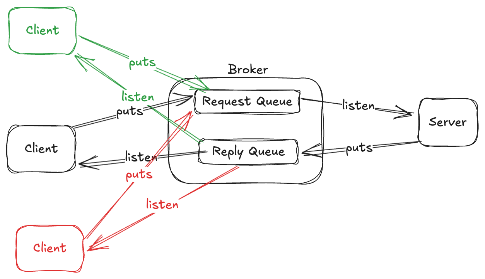

# Request Reply

This is a common usage communication pattern, Commons JMS has a basic implementation of it, in which there are two components that participates in the communication model. There is a component that acts as `Server` and another that acts as `Client`, this communication is made over two `Queues` one for requests and another for responses.

Te `Client` sends a message to the request queue, the `Server` listen from request queue and replies to response queue, which is listened by `Client`.

In this communication pattern there are some challenges, if the system has a single instance of `Client`, It is enough just to have a `Request Queue` and a `Response Queue` and the `Client` can listen all replies from the `Response Queue` because this instance is the interested in the answer.

If the system has multiple instances of `Client`, in the below image may occurs that `green` instance make the request and the response be listened in the `red` instance, If your system may accept it, you have a completelly async system. And in this case you don't need to use `ReqReply`, you should use a `MQSender` and a `MQListener` separately.

## Common Scenario

But imagine that you need to correlate the responses in the same instance that makes the request, it is a common pattern when encapsulates an async system in a sync request, for example:

In the below image, the `black` instance of `Client` makes the request and we need to guarantee that the answer sent by `Server` be received by the same `black` instance.

### Pattern Solutions

To solve this challenge there are some approaches that can be used, each of them will be detailed in a separate section

- [Using Temporary Queues](/commons-jms/docs/request-reply/temporary-queue)
- [Fixed Queue by Selector](/commons-jms/docs/request-reply/fixed-queue-by-selector)

## Considerations

- Multiple Queue Manager or Clustering:
  In this scenario you should guarantee that:
    - the application that attends the request follow the replyTo header.
    - set to `true` the property `commons.jms.input-queue-set-queue-manager` to identify and set the queue manager to the response queue (this guarantees that the application that attends the request send the response to the specific queue manager).
    - Then the same like with a single Queue Manager