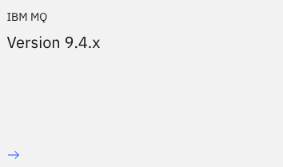
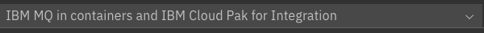
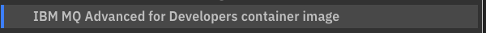
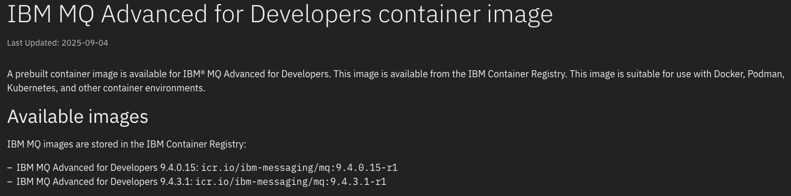

# Getting Started

This quick start tutorial sets up a single node IBMMQ and shows how to install and configure the library.

## Requirements

You need Java JRE installed (Java 17 or later).

## Start IBMMQ

Start IBMMQ on your local machine with all the defaults.

Now mq images are available in the IBM Container Registry, you ca check for latest versions with `skopeo` 

```bash
skopeo list-tags docker://icr.io/ibm-messaging/mq
```

or navigating your web in the path:

- [Go to ibm-mq page](https://www.ibm.com/docs/en/ibm-mq)
- Choose the desired version
  
  
- Select containers from menu

  

- Select reference from menu
  
  

- Select Advanced for Developers container image
  
  

- Now you can see available images

  

You can use `podman` `docker`

You should create some credential files like in a folder:

```text
mqcreds\
  mqAdminPassword
  mqAppPassword
```

Then pass the directory

```bash
docker run -e LICENSE=accept -e MQ_QMGR_NAME=QM1 -p 1414:1414 -p 9443:9443 -d --name ibmmq -v ./mqcreds:/run/secrets icr.io/ibm-messaging/mq:9.4.3.1-r1
```

If you prefer to use an older image (last version was 9.2.4) located at docker, it can be done with:

```bash
docker run -e LICENSE=accept -e MQ_QMGR_NAME=QM1 -p 1414:1414 -p 9443:9443 -d --name ibmmq -e MQ_APP_PASSWORD=passw0rd ibmcom/mq
```

Then you can access to [web console](https://localhost:9443/ibmmq/console/login.html)

User: `admin`
Password: The password set in `mqAdminPassword` file or `passw0rd` if you are using the dockerhub image

## Spring Boot Application

You can use our [Scaffold Clean Architecture Plugin](https://bancolombia.github.io/scaffold-clean-architecture/docs/getting-started) to acelerate the setup and get a clean architecture structure.

Change `3.26.1` with latest plugin version -> 

import Tabs from '@theme/Tabs';
import TabItem from '@theme/TabItem';

<Tabs>
  <TabItem value="mac" label="Mac OS / Linux" default>

```sh
mkdir commonsjms-quick-start
cd commonsjms-quick-start
echo "plugins {
    id 'co.com.bancolombia.cleanArchitecture' version '3.26.1'
}" > build.gradle
gradle ca --name=CommonsJMSQuickStart
./gradlew gda --type mq
./gradlew gep --type mq
./gradlew bootRun
```

  </TabItem>
  <TabItem value="windows" label="Windows">

> PowerShell

```powershell
# Create a directory and navigate into it
New-Item -ItemType Directory -Name "commonsjms-quick-start"
Set-Location -Path "commonsjms-quick-start"

# Create the build.gradle file with the specified content
@"
plugins {
    id 'co.com.bancolombia.cleanArchitecture' version '3.26.1'
}
"@ | Set-Content -Path "build.gradle"

# Run the Gradle commands
gradle ca --name=CommonsJMSQuickStart
.\gradlew gda --type mq
.\gradlew gep --type mq
.\gradlew bootRun
```

> CMD

```cmd
@echo off

:: Create a directory and navigate into it
mkdir commonsjms-quick-start
cd commonsjms-quick-start

:: Create the build.gradle file with the specified content
(
echo plugins {
echo     id 'co.com.bancolombia.cleanArchitecture' version '3.26.1'
echo }
) > build.gradle

:: Run the Gradle commands
gradle ca --name=CommonsJMSQuickStart
gradlew gda --type mq
gradlew gep --type mq
gradlew bootRun

```

  </TabItem>
</Tabs>